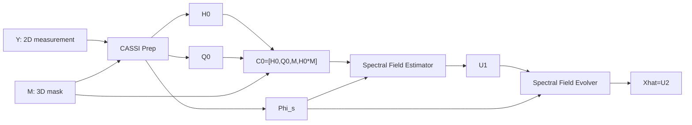

# SMILE² Algorithm and Signal Flow

> Current authority: 2026-07-16  
> This file fixes the notation, formulas, and signal flow for the current E2E paper. Historical routes are in `legacy.md`.

## 1. CASSI forward model

Let \(X\in\mathbb{R}^{H\times W\times L}\) be the target HSI and \(M\in\mathbb{R}^{H\times W\times L}\) be the coded aperture mask. The CASSI measurement is

$$
Y=\Phi X=\sum_{\lambda=1}^{L}\mathrm{Shift}_{\lambda}(M_\lambda\odot X_\lambda).
$$

The shifted sensing mask is denoted by \(\Phi_s\). The normalization map is

$$
P=\Phi\Phi^\top=\sum_{\lambda=1}^{L}\Phi_{s,\lambda}^{2}.
$$

Here \(\Phi\) maps the 3D HSI field to the 2D CASSI measurement plane, so \(\Phi\Phi^\top\) is a diagonal normalization operator in the measurement domain. In implementation, it is stored as a 2D normalization map

$$
P\in\mathbb{R}^{H\times W'} ,
$$

where \(W'\) is the dispersed measurement width. Each element of \(P\) sums the shifted-mask energy of all spectral bands that land on the same measurement pixel. Thus \(P\) is not a scalar. It normalizes the adjoint/shift-back operation and compensates for nonuniform mask coverage across the measurement plane. We use \(P_\epsilon=P+\epsilon\) in divisions for numerical safety.

## 2. CASSI Field Preparation

The dirty shift-back field is

$$
H_0=\Phi^\top(Y/P_\epsilon).
$$

The measurement residual and residual-adjoint cue are

$$
R_0=Y-\Phi H_0,
\qquad
Q_0=\Phi^\top(R_0/P_\epsilon).
$$

The SFE input tensor is

$$
C_0=[H_0,Q_0,M,H_0\odot M].
$$

Here \(H_0\) provides the initial observed field, \(Q_0\) exposes what the forward model still cannot explain, \(M\) provides the coded-aperture geometry, and \(H_0\odot M\) couples image content with sensing structure.

## 3. Spectral Field Estimator

The Spectral Field Estimator first predicts a residual correction:

$$
\Delta_\psi(C_0)=\mathrm{Conv}^{0}_{3\times3}
\left(
\sigma(\mathrm{Conv}_{3\times3}(C_0))
\right).
$$

The last convolution is zero-initialized, so at initialization

$$
Z_0=H_0+\Delta_\psi(C_0)=H_0.
$$

The first SWP-based U-Net then estimates a cleaner field:

$$
U_1=\mathcal{E}_{\theta_E}^{\mathrm{SWP}}(Z_0,\Phi_s).
$$

In the architecture figure, the SFE stem and this first SWP-based U-Net are drawn together as **Spectral Field Estimator**.

## 4. Spectral Field Evolver

The Spectral Field Evolver does not recompute \(R_0\) or \(Q_0\). It only continues the physical evolution from \(U_1\):

$$
U_2=\mathcal{E}_{\theta_V}^{\mathrm{SWP}}(U_1,\Phi_s),
\qquad
\hat X=U_2.
$$

Thus the current two-step model is

$$
Y,M
\xrightarrow{\text{CASSI Prep}}
H_0,Q_0,M,\Phi_s
\xrightarrow{\text{SFE}}
U_1
\xrightarrow{\text{SFEvolver}}
\hat X.
$$

## 5. SWP: Spectral Wave Propagator

Given a feature field \(z\), Mask A forms a CASSI-gated wave field:

$$
\tilde z=(\epsilon+(1-\epsilon)\Phi_s)\odot z.
$$

SWP then computes two Fourier-domain initial states:

$$
\hat u_0=\mathcal{F}(\Pi_u(\tilde z)),
\qquad
\hat v_0=\mathcal{F}(\Pi_v(\tilde z)),
$$

where \(\Pi_u(\cdot)\) and \(\Pi_v(\cdot)\) are learned projections. The 3D damped wave equation is

$$
\partial_{tt}u+\alpha\partial_tu
=
v_s^2(\partial_{xx}+\partial_{yy})u
+v_\lambda^2\partial_{\lambda\lambda}u.
$$

In the Fourier domain:

$$
\omega_0^2=(2\pi)^2\left[v_s^2(f_\lambda)(f_x^2+f_y^2)+v_\lambda^2 f_\lambda^2\right],
\qquad
\eta=\omega_0^2-\left(\frac{\alpha(f_\lambda)}{2}\right)^2.
$$

The closed-form solution is

$$
\hat u(t)=
e^{-\alpha(f_\lambda)t/2}
\left[
\hat u_0 C_s(\eta,t)
+
\left(\hat v_0+\frac{\alpha(f_\lambda)}{2}\hat u_0\right)
S_n(\eta,t)
\right].
$$

The spatial-spectral field is recovered by inverse FFT:

$$
u(t)=\mathcal{F}^{-1}(\hat u(t)).
$$

The parameters \(\alpha(f_\lambda)\) and \(v_s(f_\lambda)\) are described as **spectral-mode-dependent damping and propagation speed**.

The FFT along \(\lambda\) uses a discrete periodic spectral-mode basis for the finite 28-band sampled field. This is a learnable prior on the sampled spectral field, not a claim that real spectral reflectance is physically periodic along wavelength.

## 6. Internal feature gate in the Evolver

Some SWP blocks contain an internal feature gate implemented by a lightweight branch:

$$
g(x)=\mathrm{DWConv}_{11\times11}(\mathrm{Conv}_{1\times1}(x)),
\qquad
y'=y_{\mathrm{wave}}\odot g(x).
$$

In the figure, this is simply an element-wise multiplication branch inside SFE/SFEvolver. It is not named as a separate paper module.

## 7. Shared and non-shared variants

For shared two-step evolution:

$$
\theta_E=\theta_V.
$$

For non-shared two-step evolution:

$$
\theta_E\ne\theta_V.
$$

The current paper family uses this distinction to define small and medium variants, not to claim deep unfolding.

## 8. Training objective

The main training objective is reconstruction RMSE. For a single final output,

$$
\mathcal{L}_{\mathrm{rec}}
=
\sqrt{\frac{1}{HWL}\|\hat X-X\|_2^2+\epsilon_l}.
$$

For the current two-step progressive estimation-evolution model, both intermediate and final fields are supervised:

$$
\mathcal{L}_{\mathrm{prog}}
=
\sum_{k=1}^{K}\beta_k
\sqrt{\frac{1}{HWL}\|U_k-X\|_2^2+\epsilon_l}.
$$

The two-step setting uses \(\beta=[0.2,1.0]\). There is no SAM loss, SSIM loss, spectral-angle loss, or spectral-derivative loss in the main training objective. SAM is used only for evaluation.

## 9. Complexity statement

SWP performs global spatial-spectral mixing through FFT-domain propagation. At the operator level, the global mixing cost is

$$
O(N\log N),
$$

where \(N\) denotes the number of spatial-spectral samples. The full network runtime also includes convolutional projections, U-Net hierarchy, memory layout, and implementation overhead. Therefore the paper should claim **operator-level structured global mixing**, not unconditional end-to-end runtime dominance.

## 10. Minimal flowchart

